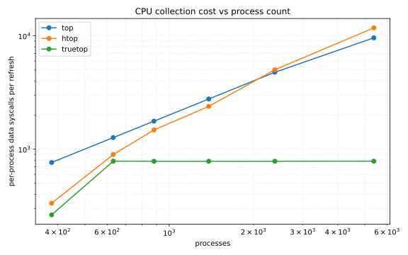

# Benchmarks

Extracting per-process CPU is O(1) in syscalls with eBPF vs O(N) with procfs.
Both are O(N) in time; the difference is a constant factor — the eBPF path makes
no per-process syscall, avoiding the VFS open/read and the text formatting of
`/proc/<pid>/stat`.

Two benchmarks measure two different things, and the claim is both together:

- **micro** — the per-process *work*, modelled in memory. It isolates the
  constant factor (eBPF ~4 ns vs procfs ~14 µs per process) and deliberately
  makes no `bpf()` call, so it is not a syscall-count measurement.
- **macro** — the real, end-to-end *syscall* count per refresh, traced with
  `strace` against the actual tools. This is where the O(1)/O(N) split shows.

The micro answers "is the per-process work cheaper?"; the macro answers "does it
cut syscalls at scale?". Neither alone is the headline.

## micro: per-process work

```sh
cargo bench -p truetop-bench
```

Sweeps N and compares two ways to get the same result (total on-CPU ns over N
processes):

| path           | source                                       | syscalls |
| -------------- | -------------------------------------------- | -------- |
| ebpf_batched   | one `bpf_map_lookup_batch` (modelled in mem) | O(1)     |
| procfs_per_pid | open/read/parse `/proc/<pid>/stat` per pid   | O(N)     |

Criterion writes a log-Y HTML report to `target/criterion/`. Both lines rise
linearly; the eBPF one sits ~3500x lower (~4 ns vs ~14 µs per process).

The real syscall count is the collector itself — one `BPF_MAP_LOOKUP_BATCH` per
tick (`batch::BatchReader`), measured in the macro benchmark below.

`procfs_per_pid` re-reads `/proc/self/stat` (one cached file), the best case for
procfs; the macro benchmark reads N distinct files, so the real gap is wider.

Results compare against the last run's baseline, so a busy machine prints
spurious regressed/improved lines — `rm -rf target/criterion` and pin the
governor to `performance` for clean numbers.

## macro: vs top and htop

```sh
sudo ./macro/run.sh && ./macro/plot.py   # writes scaling.svg
```

Counts per-process data syscalls per refresh against the real tools under
`strace -fy`: `read`/`pread64` on `/proc/<pid>/{stat,statm,status,cmdline}`
(`-y` resolves cached fds back to paths, so reads off a held fd still count)
plus `bpf`, divided by refreshes. A load generator (`src/bin/load.rs`) forks N
processes that reschedule at ~0% CPU — truly idle ones never reschedule, so no
monitor would see them.

truetop runs headless (`truetop --bench <ticks>`). strace ptrace-traps every
syscall, and the TUI input poll issues enough of them to starve the collector
under tracing — the traced run never completes a tick. `--bench` drives the
collector directly with no terminal, so the trace is the collection path only;
the tick count is fixed, so reads divide by it without a per-scan marker.

btop is omitted. It reads `/proc/<pid>` per process like htop (same O(N) class)
but its TUI defeats strace the same way truetop's does; htop covers the procfs
case.



top and htop are linear: one `/proc/<pid>` file per process per refresh. truetop
is flat — the collector reads the CPU map in one batch and touches `/proc` only
for the visible viewport (256 rows, one `statm` read and one name lookup each),
independent of N.

truetop issues fewer syscalls than both at every measured point — 264 vs htop
334 / top 764 at 380 processes, 784 vs 11750 / 9601 at 5382. Its cost is bounded
by the viewport and counts only *active* processes; top and htop stat every
process each refresh. The flat ~784 is the saturated 256-row viewport; at 380
processes (mostly idle) truetop tracks the active count instead. (The visible
crossing in the plot is top and htop, not truetop.)

A crossover exists only below where it matters: if fewer than ~256 processes are
all active at once, procfs's single stat per file can undercut truetop's per-row
read plus name lookup. Real systems run hundreds of processes with few active,
so truetop wins in practice, and the gap is unbounded as N grows.

Not counted on truetop's side: the `sched_switch` program, which runs in the
kernel on every context switch (`bpftool prog show` reports that cost). The
syscall metric is the user-space refresh cost, where the O(1)/O(N) split is.
