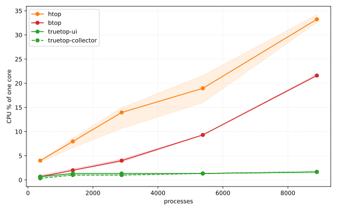
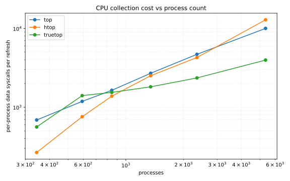
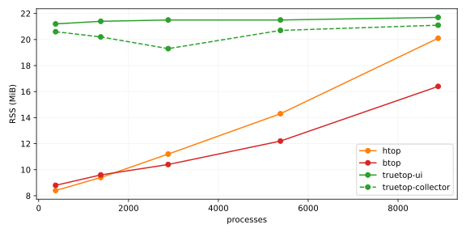

# Benchmarks


Reference machine: AMD Ryzen 7 5800HS, 8 cores / 16 threads. Details and caveats below.

> [!WARNING]
> **Status, 2026-07-28.** Two findings invalidate part of this page.
>
> The batched read stopped at the first partially-filled batch instead of at
> `ENOENT`, so above roughly 4,000 live processes the collector folded ~4,095
> entries and silently dropped the rest. Every figure here taken above that count
> measured a collector doing a fraction of the work it should have, which
> flatters the CPU line in particular.
>
> Separately, the absolutes no longer reproduce: the same pre-LRU hotpath code
> measures 479 ns on this machine today against the ~335 ns published below.
> Kernel, mitigations and thermal envelope have all moved since.
>
> The A/B deltas below were measured back to back and stand. The absolutes are
> pending a controlled re-run.

| metric                              | truetop               | htop / btop           |
| ----------------------------------- | --------------------- | --------------------- |
| CPU at ~7,400 processes             | **1.7%** of a core, flat | 33% / 22%, climbing |
| data syscalls per refresh at ~5,000 | **~780**              | ~12,000 (htop)        |
| per-process collection work         | **~30 ns**            | ~12 µs (procfs)       |

*Exclusive:* per-process D-state I/O wait, which none of them show. *Cost:* the
kernel `sched_switch` hook runs on every context switch (~200-350 ns each), so
truetop is cheaper than htop only while switches/s < ~80,000 + 130 x processes; a
switch-heavy machine with few processes costs more, not less. RSS is a higher but
flat ~20 MiB floor.

Per-process CPU is collected in-kernel and pulled in one batched syscall, instead
of parsing `/proc/<pid>/stat` once per process. That makes CPU collection O(1) in
syscalls per refresh instead of O(N). The price is an O(1) eBPF program on every
context switch, measured in the hotpath benchmark below.

## Result



CPU% of one core, median, htop/btop at a 1s refresh:

| processes | htop | btop | truetop |
| --------: | ---: | ---: | ------: |
|       373 |  4.0 |  0.7 |     0.3 |
|     1,374 |  7.6 |  2.0 |     1.0 |
|     2,879 | 11.6 |  4.3 |     1.0 |
|     5,377 | 19.9 |  9.3 |     1.3 |
|     7,434 | 33.2 | 22.6 |     1.7 |

htop and btop read one `/proc` entry per process each refresh (O(N)); truetop
batch-reads the CPU map and touches `/proc` only for the visible viewport, so it
stays flat. At ~7,400 processes that is ~20x less CPU than htop and ~13x less than
btop, and the gap widens with N.

The cost is flat with process turnover too, not just count. Under 3,330 forks per
second at 379 live processes - the churn of a heavy parallel build - truetop reads
every fork and exit in the kernel and reaps each departed process's counters, yet
collection still sits at 1.7% of a core: its ceiling above, and below htop's 4.3%.
The per-exit bookkeeping does not show up.

This is the user-space cost; the kernel `sched_switch` price and the RSS trade-off
are in the sections below.

## At a glance

|             | Measures                          | Method                            | Run                         |
| ----------- | --------------------------------- | --------------------------------- | --------------------------- |
| **micro**   | per-process collection work       | in-memory model, no `bpf()` call  | `cargo xtask bench micro`   |
| **macro**   | data syscalls per refresh at scale | `strace` vs top / htop           | `cargo xtask bench macro`   |
| **hotpath** | kernel cost per context switch    | `bpftool` run stats + `hackbench` | `cargo xtask bench hotpath` |
| **selfcpu** | the tool's own CPU% and RSS, by process count and by churn | sample `/proc` vs btop / htop | `cargo xtask bench selfcpu` |
| **switch**  | that cost under a switch storm    | `stress-ng --switch` vs btop / htop | `cargo xtask bench switch` |

## Running

```sh
cargo xtask bench                  # micro, macro, hotpath
cargo xtask bench micro macro      # or any subset, in any order
cargo xtask bench selfcpu switch   # opt-in: need btop/htop/stress-ng installed
```

One command builds what it needs, runs the benchmarks, and for stable numbers
pins the CPU governor to `performance`, disables turbo, and pins the micro
benchmark to one core. It restores the original CPU settings on exit, including on
error, so the machine is never left tuned. Pass `--no-prep` to skip the tuning (on
a VM or in CI). Everything but micro needs root, so it elevates with `sudo`.

Every benchmark writes to `bench/results/`: the criterion report under
`criterion/`, plus `macro.csv`, `hotpath.txt`, `selfcpu.csv`, `switch.csv`, the
`scaling.svg` / `selfcpu-cpu.svg` / `selfcpu-rss.svg` plots, and `env.txt` (commit,
kernel, CPU, governor, clocksource). Only the `.svg` plots are tracked in git; the
rest is regenerated per run.

### Requirements

micro needs only a Rust toolchain; the rest shell out to standard tools and need
root. Each script names its own missing dependencies before doing any work, so a
partial install fails on the benchmark that needs the tool, not halfway through it.

| benchmark | tools it calls                                                            |
| --------- | ------------------------------------------------------------------------- |
| micro     | `cargo` (criterion is a dev-dependency); `taskset` used for pinning if present |
| macro     | `strace`, `script`, `top`, `htop`; `python3` + `matplotlib` for the plot  |
| hotpath   | `bpftool`, `jq`, `hackbench`, `perf`                                       |
| selfcpu   | `script`, `btop`, `htop`; `python3` + `matplotlib` for the plot           |
| switch    | `script`, `btop`, `htop`, `stress-ng`, `bpftool`, `jq`                     |

`script`, `taskset`, and `timeout` come from util-linux/coreutils and are almost
always already installed. The rest, by distro:

```sh
# Arch (hackbench is in the AUR via rt-tests)
sudo pacman -S --needed strace htop btop bpf jq perf stress-ng python-matplotlib

# Debian / Ubuntu
sudo apt install strace htop btop jq rt-tests stress-ng python3-matplotlib linux-tools-$(uname -r)
```

Package names vary; the table above is the source of truth for what must be on
`PATH`. `bpftool` ships with the kernel tools (`bpf` on Arch,
`linux-tools-$(uname -r)` on Debian), and `hackbench` ships with `rt-tests`.

## micro: per-process work

```sh
cargo xtask bench micro            # wraps: cargo bench -p truetop-bench
```

Sweeps N and compares the two collection paths. Both compute the same thing, the
total on-CPU nanoseconds over N processes:

| path             | source                                         | syscalls |
| ---------------- | ---------------------------------------------- | -------- |
| `ebpf_batched`   | fold per-CPU slots into the `tgid → ns` map    | O(1)     |
| `procfs_per_pid` | open / read / parse `/proc/<pid>/stat` per pid | O(N)     |

The eBPF arm builds a `HashMap` the same way `batch::fold` does: it sums each
key's per-CPU slots and inserts the result. A bare summation would leave out the
insert and undercount what the collector actually does per process.

Criterion writes a log-Y HTML report to `bench/results/criterion/`. Both lines
rise linearly, and the eBPF one sits orders of magnitude lower. On the reference
machine (AMD Ryzen 7 5800HS, 8 cores / 16 threads) that is roughly 30 ns per process for eBPF
against 12 µs for procfs, about 400x. The figures are machine-specific, so
regenerate them for yours; the shape holds.

`procfs_per_pid` re-reads `/proc/self/stat`, one cached file, which is the best
case for procfs. The macro benchmark reads N distinct files, so the real gap is
wider. What the collector actually issues per tick (`batch::BatchReader`) is
measured in the macro benchmark below.

## macro: versus top and htop



Per-process data syscalls per refresh, traced with `strace` against the real tools:

| Processes | top    | htop   | truetop | truetop's edge |
| --------: | -----: | -----: | ------: | -------------: |
|       362 |    728 |    332 | **309** |           1.1x |
|       613 |  1,230 |    896 | **783** |           1.1x |
|       863 |  1,731 |  1,481 | **782** |           1.9x |
|     1,364 |  2,733 |  2,374 | **782** |           3.0x |
|     2,364 |  4,733 |  5,127 | **782** |           6.0x |
|     5,365 | 10,449 | 11,959 | **782** |          13.4x |

top and htop read one `/proc/<pid>` file per process, so their cost grows with
process count. truetop batch-reads the CPU map once and touches `/proc` only for
the visible viewport, so it stays flat. At 5,365 processes it issues ~780 syscalls
per refresh against htop's ~11,959. Edge is the fewest-syscall competitor divided
by truetop; lower is better.

```sh
cargo xtask bench macro            # wraps: sudo bench/macro/run.sh + plot.py
```

Counts per-process data syscalls per refresh against the real tools under
`strace -fy`: `read` / `pread64` on `/proc/<pid>/{stat,statm,status,cmdline}`
(`-y` resolves cached fds back to paths, so reads off a held fd still count) plus
`bpf`, divided by refreshes. A load generator (`src/bin/load.rs`) forks N
processes that reschedule at ~0% CPU. Truly idle ones never reschedule, so no
monitor would see them anyway.

These per-refresh figures are an approximation, not an exact count. Reads are
divided by a refresh count inferred per tool: top and htop by each reopen of the
`/proc` directory, truetop by its fixed tick count. The proxy is close, because
top and htop genuinely reopen `/proc` every scan, but read the numbers as the
scaling shape rather than exact syscall counts.

The collector reads the CPU map with `BPF_MAP_LOOKUP_BATCH` (one call per 4096
live pids, so one in the common case) and touches `/proc` only for the visible
viewport: 256 rows, each a `statm` read plus a `comm` map lookup, which is itself
a `bpf` syscall. So the per-refresh cost is O(N/4096) batch calls plus O(viewport)
lookups, flat in N once the viewport saturates. The flat ~782 is the saturated
256-row viewport; at 362 processes (mostly idle) truetop tracks the active count
instead. The visible crossing in the plot is between top and htop, not truetop.

There is a crossover, but only below the point where it matters. If fewer than
about 256 processes are all active at once, procfs's single stat per file can beat
truetop's per-row read plus name lookup. Real systems run hundreds of processes
with few active, so truetop is cheaper in practice, and the gap grows with N.

**Why `--bench`.** truetop runs headless (`truetop --bench <ticks>`). `strace`
ptrace-traps every syscall, and the TUI input poll issues enough of them to starve
the collector under tracing, so the traced run never completes a tick. `--bench`
drives the collector directly with no terminal, so the trace covers the collection
path only. The tick count is fixed, so reads divide by it without a per-scan
marker.

**Why btop is omitted.** It reads `/proc/<pid>` per process like htop (same O(N)
class), but its TUI defeats `strace` the same way truetop's does. htop covers the
procfs case.

Not counted on truetop's side: the `sched_switch` program, which runs in the
kernel on every context switch. The count here is the user-space refresh cost,
where the O(1) vs O(N) split is. The kernel cost is the hotpath benchmark.

## hotpath: kernel cost per context switch

```sh
cargo xtask bench hotpath          # wraps: sudo bench/hotpath/run.sh
```

The macro benchmark counts the per-process syscalls truetop avoids in user space.
This one counts what it adds in the kernel. `sched_switch` runs on every context
switch, which is the trade-off the README's Overhead section describes.

With `kernel.bpf_stats_enabled`, `run_time_ns / run_cnt` is the whole invocation,
helper calls included; it is sampled over short windows during a `hackbench` storm
and reported as a median with IQR. `perf` separately attributes cycles to the JIT'd
`bpf_prog_*` symbol, which covers the program's own code only: helpers are kernel
functions and land in their own symbols, so the difference is what they cost. The
wall-clock overhead is a difference of two noisy runs, so it is order of magnitude
only.

Reference machine (Ryzen 7 5800HS, 8 cores / 16 threads, turbo off, `tsc` clocksource), under
`hackbench`: **~335 ns/event**, IQR [333, 337] (n=22), whole-system overhead
single-digit percent. perf puts about a quarter of that in the program's own code
and the rest in helper calls: the clock read, the `task_struct` probe reads, and
the map operations. The total is the reliable figure; the split is a sampling
estimate that moves a few tens of ns between runs.

It is not one number. It tracks cache locality, because the probe reads dominate:
hackbench churns 640 distinct tasks and costs ~335 ns/event, while
`stress-ng --switch` alternates between few hot ones and costs ~190 ns. Read it as
**roughly 200-350 ns, depending on how many distinct tasks are switching**.

It also tracks the machine's clocksource, since `bpf_ktime_get_ns` runs once per
event: a `tsc` read is ~20 ns, an `hpet` one ~1 µs, which roughly triples the
per-event cost. `env.txt` records the clocksource with every run for that reason.

Four changes, same machine:

| stopwatch, state read, prev ids                 | per-event          |
| ----------------------------------------------- | ------------------ |
| tid-keyed per-CPU hashmap, probe-read state     | ~630 ns            |
| single-slot array, in-place counter add         | ~434 ns            |
| `prev_state` from the tracepoint arg (>= 5.18)  | ~391 ns            |
| `bpf_get_current_pid_tgid` for prev's ids       | ~335 ns [333, 337] |

Each step's A/B had non-overlapping IQRs. Numbers are machine-specific; re-run for
yours.

### Capacity is not what these measure

No benchmark here reaches the accounting maps' capacity, and none should: a
saturated map evicts, so the run would measure degraded behaviour rather than the
design. The margin is deliberate - `selfcpu` tops out at 10,000 processes and
`macro` at 5,000, against a default capacity of 65,536. Scaling either past that
means raising `--max-processes` in the same change.

### What capacity costs

The accounting maps were plain per-CPU hashes of a fixed 16,384 entries, and a
full one returns `E2BIG`: the hotpath dropped the write, and that process read
0.0% for the rest of its life. They are LRU now, so a full map evicts its coldest
entry instead and accounting degrades rather than lying. `--max-processes` sets
the size; its default is capped by a memory budget, because an LRU map is
preallocated and a per-CPU one costs `entries x 8 x possible_cpus`.

Measured back to back under `hackbench`, one session:

| accounting map                     | per-event                |
| ---------------------------------- | ------------------------ |
| plain per-CPU hash, 16,384 entries | 479.0 ns [477.4, 481.3]  |
| LRU, 65,536 entries                | 500.1 ns [497.9, 502.8]  |
| LRU, 16,384 entries                | 522.0 ns [513.7, 525.8]  |

**LRU costs 20-45 ns per event.** Both LRU runs sit above the plain hash with
non-overlapping IQRs, so the direction is certain; the width is what one machine
can resolve. The kernel sets a reference bit on every lookup a BPF program makes,
which is what the hotpath pays. The per-tick read from user space does not,
because the syscall lookup path deliberately does not mark entries, so a full map
walk cannot disturb eviction order. Nothing was evicting during these runs -
hackbench's few hundred tasks sit well inside either map - so this is
steady-state overhead, not the cost of eviction.

The third row was an attempt to separate the map type from the capacity increase
and it failed: the smaller map measured *slower*, which a larger table cannot
cause, and that run's IQR was three times wider with the storm overhead swinging
+6% against the previous run's -4%. So the capacity contribution is below this
machine's noise floor, and no part of the 20-45 ns is attributed to it. Worth
recording rather than re-running: the between-session noise here is wider than
the effects being chased.

We took the trade. A monitor may run out of capacity; it must not report zero and
say nothing.

One change we did not make: raising the minimum kernel would let the one global map
on this path move to task-local storage, but perf prices that map's lookup at a
fraction of a percent of storm cycles, ~5% of the per-event cost after the
replacement's own overhead. Not worth dropping 5.10 support. A later version can
detect the kernel at load and take the faster path where it exists, giving 5.15+
users the win, once the VM matrix in CI can test both paths. Note the fit is
specific to that map: `SLEEP_SINCE` holds per-thread state that dies with the
thread, which is what task storage is for. The per-process counters are the
opposite case - they have to outlive the task, since a process that lived and
died between two ticks is still charged - so they cannot move there without an
exit-time flush into a map, which is the thing being replaced. aya-ebpf also
exposes no task-storage map type today.

## selfcpu: the tool's own cost

```sh
cargo xtask bench selfcpu          # wraps: sudo bench/selfcpu/run.sh + plot.py
```

The chart and table are the Result at the top. The other benchmarks measure
truetop's collection path; this one measures the whole running process. It samples
`/proc/<pid>/stat` for each monitor under a controlled load (the `load` generator
forks N processes that reschedule at ~0% CPU so every monitor sees them), and
reports CPU% as a median with IQR over windows long enough to average out the
refresh, plus RSS from `statm`. truetop appears twice: with its UI (parity with
btop/htop, which render) and as the headless collector (`--bench`). At idle the UI
and the collector read the same ~0: redraw-on-change means the UI does not repaint
while the snapshot is unchanged.

This is the user-space cost only. truetop's total also carries the kernel
`sched_switch` cost from the hotpath benchmark, which htop and btop do not pay; it
scales with the context-switch rate, so on a switch-heavy machine it can offset the
user-space saving.



RSS is a trade-off. truetop has a higher fixed floor (~20 MiB: the eBPF maps plus
the async runtime) but stays flat; htop and btop start near 8-9 MiB and grow with
N, crossing truetop around 8,000 processes. Below that, truetop uses more.

Caveats: htop and btop CPU% depends on their configuration (columns, tree view,
meters); these ran defaults at a normalised 1s refresh, and the figure is
terminal-geometry dependent (render cost scales with visible rows). The jiffy
resolution (~0.3% per window) separates truetop from the others but is too coarse
to split the UI from the collector; that needs `perf stat`.

## switch: cost under a context-switch storm

```sh
cargo xtask bench switch           # wraps: sudo bench/switch/run.sh
```

selfcpu loads the machine with processes, which is what htop and btop scale with.
This one loads it with context switches, which is what truetop scales with:
`stress-ng --switch` drives the rate while few processes exist. Each tool's own
CPU% comes from `/proc`; for truetop the kernel `sched_switch` cost is added from
bpf_stats, so its total is user-space plus kernel against htop/btop's user-space.

Reference machine, CPU% of one core:

| ctxt/s | htop | btop | truetop (user + kernel) |
| -----: | ---: | ---: | ----------------------: |
|   661k | 3.80 | 0.90 |  **11.5** (0.6 + 10.9)  |
|  2.09M | 3.90 | 0.60 |  **43.1** (0.6 + 42.5)  |
|  4.84M | 5.10 | 1.00 | **124.4** (0.9 + 123.5) |

truetop loses here, and by a lot. Its user-space stays flat (~0.6%), but the kernel
hook runs on every switch, so its total tracks the switch rate; htop and btop do
not care about the rate at all.

Together with selfcpu that gives the whole trade-off in one line. truetop is
cheaper than htop while

    context switches/s  <  ~80,000 + 130 x (process count)

A desktop at a few hundred processes and tens of thousands of switches per second
sits far inside that. A switch-heavy server with few processes does not: there,
truetop costs more than the tool it replaces.
